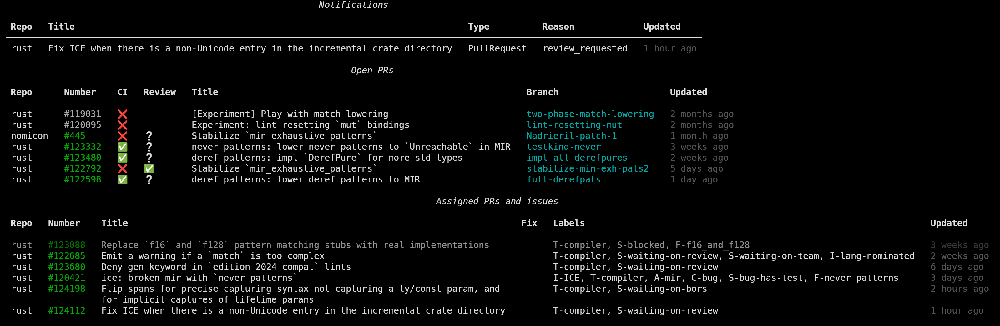

# github-status

A small command line to display important information from GitHub. It's opinionated for my usecase
and will change as my needs evolve. Take it as a base to play with.

Currently displays:
- Notifications (filtered for current org);
- Open PRs, with CI and review status;
- Assigned issues, with detection of "this issue is fixed by PR #xxx" and "blocked" labels.

It uses [terminal hyperlinks](https://github.com/Alhadis/OSC8-Adoption/) for links.
